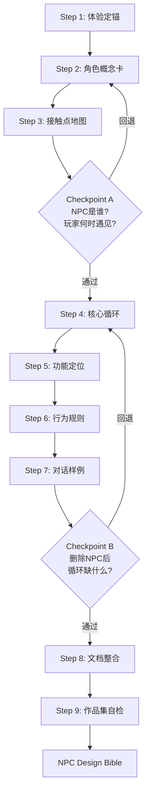

<div align="center">

<link rel="preconnect" href="https://fonts.geekzu.org">
<link rel="preconnect" href="https://fonts.gcdn.geekzu.org" crossorigin>
<link href="https://fonts.geekzu.org/css2?family=Bitcount+Ink:wght@100..900&display=swap" rel="stylesheet">


</div>

<div align="center">

[]()

[]()
[](./LICENSE)

</div>

---

> **NPC 设计桥不是 NPC 生成器，而是一个面向设计学生的"玩法锚定型 NPC 设计教练"。**
>
> 它把模糊角色灵感转译为可评审、可迭代、可进入作品集的 **NPC Design Bible**。

---

## 定位

| 不是 | 而是 |
|-----|------|
| 不是 NPC 人设生成器 | 是 NPC 玩法功能转译器 |
| 不是写故事工具 | 是角色-机制-玩家体验的对齐工具 |
| 不是高级策划替代品 | 是设计学生的学习脚手架 |
| 不是 Unity/UE 教程 | 是作品集级 NPC 设计文档生产 Skill |

---

## 解决什么问题

很多设计学生在做游戏相关作品集时，擅长设定角色外观、性格和故事，却很难回答：
- 这个 NPC 在核心循环中承担什么功能？
- 玩家为什么需要它？
- 如果删掉它，游戏体验会损失什么？

NPC 设计桥把设计学生熟悉的**体验目标、关系隐喻、接触点地图**，转译为游戏设计中的**核心循环、功能定位、行为规则和对话机制**。

---

## 核心方法：Design Bridge × Gameplay Anchor

```
设计语境桥接 (Design Bridge)          玩法锚定检验 (Gameplay Anchor)
         │                                      │
设计学生熟悉的语言                →            游戏设计语言
· 情绪 / 体验目标                         · 玩家体验目标 (PEG)
· 角色概念卡                              · NPC 功能定位
· 接触点地图                               · 核心循环嵌入
· 关系隐喻                                 · 行为规则定义
         │                                      │
         └──────────── 9 步流程 ─────────────────┘
                            │
                    NPC Design Bible
```

### 核心路线

> **设计语境桥接 → 玩法锚定 → 作品集文档整合**

---

## 9 步流程



### 阶段一：设计桥接 (Step 1-3)
从设计学生熟悉的语言启动——情绪、接触点、关系隐喻。不要求预先掌握游戏术语。

### 阶段二：玩法锚定 (Step 4-7)
回答核心问题：**这个 NPC 在玩法里负责什么？** 用删除测试、功能罗盘、行为规则来检验。

### 阶段三：作品集成 (Step 8-9)
整合产出为 NPC Design Bible，通过三镜头评审、微型模拟游玩、9 项评分完成作品集级质量审查。

---

## Quick Start

### 三步启动

```bash
# 1. 复制 Skill 到你的 Agent 工作区
cp -r npc-design-bridge/ ~/.agent/skills/npc-design-bridge/

# 2. 在 Agent 对话中激活
“帮我设计一个 NPC”

# 3. 跟随 9 步引导，导出 NPC Design Bible
python scripts/export_bible.py output/npc_design_bible.md
```

### 单步验证

```bash
# 验证 NPC Design Bible 完整性
python scripts/validate_bible.py output/npc_design_bible.md --verbose

# 仅验证不出错
python scripts/validate_bible.py output/npc_design_bible.md --validate-only
```

---

## Before / After：从"人设"到"玩法功能"

### 用户输入

> 我想做一个温柔的老奶奶 NPC，喜欢喝茶，慢、耐心，希望她出现在治愈经营类游戏里，但我不知道她在玩法里有什么用。

### 普通 AI 可能输出

> 她叫王奶奶，年轻时是一位茶道大师，退休后在小镇开了一家茶馆。她性格温柔慈祥，总是穿着碎花围裙...

*(全是人设，无玩法关联)*

### NPC 设计桥输出

> **节奏调节器型 NPC** — 当玩家操作过快、任务堆积或迷失目标时，她通过泡茶、对话和小任务让玩家慢下来，并解锁隐藏配方或叙事线索。
>
> **删除测试**: 如果删掉她——玩法缺了新手引导，情绪缺了温暖感，信息缺了故事线索，节奏缺了"慢下来"的触发机制。

### 行为规则示例

| 触发条件 | NPC 反应 | 玩家影响 |
|---------|---------|---------|
| 玩家连续快速点击 5 次 | "茶要慢慢泡呢" + 画面舒缓 | 降低操作焦虑 |
| 玩家连续失败 2 次 | 安慰对话 + 简化任务 | 降低挫败感 |
| 完成茶馆升级 | 解锁回忆故事 + 新配方 | 叙事奖励 |

---

## Skill Architecture

```
npc-design-bridge/
├── SKILL.md                     # Skill 核心执行说明
├── README.md                    # 项目首页
│
├── prompts/                     # 10 个分步提示模块
│   ├── system_prompt.md         # 角色、边界、语气
│   └── step_01~09_*.md          # 9 步执行指引
│
├── templates/                   # 输出模板
│   ├── npc_design_bible_template.md
│   ├── character_concept_card.md
│   ├── touchpoint_map.md
│   ├── behavior_rule_table.md
│   └── portfolio_review_checklist.md
│
├── examples/                    # 完整示例（4 个类型）
│   ├── tea_grandma_cozy_sim/    # 治愈经营
│   ├── suspicious_vendor_rpg/   # RPG
│   ├── lost_robot_sci_fi/       # 科幻
│   └── silent_guide_horror/     # 恐怖
│
├── tests/                       # 测试用例
│   ├── golden_cases.md          # 成功样例
│   ├── edge_cases.md            # 异常输入处理
│   └── evaluation_rubric.md     # 9 项评分标准
│
├── scripts/                     # 工具脚本
│   ├── export_bible.py          # 文档导出
│   └── validate_bible.py        # 完整性验证
│
├── references/                  # 参考知识
│   ├── npc_design_framework.md
│   └── game_design_terms_for_design_students.md
│
├── docs/                        # 设计文档
│   ├── design_rationale.md      # 设计理由
│   └── tt_collaboration_log.md  # TT 协同记录
│
└── .github/workflows/           # CI 自检
    ├── ci.yml                   # 结构 + 格式 + 安全
    └── skill-packaging.yml      # Skill 打包验证
```

---

## TT Collaboration 专家协同矩阵

| 阶段 | TT 专家分身 | 介入时机 | 判断标准 | 产出增量 |
|-----|-----------|---------|---------|---------|
| 设计桥接 | 服务设计专家 | 用户只有模糊情绪时 | 是否能转为体验目标 | 体验目标句、接触点地图 |
| 设计桥接 | 视觉叙事专家 | 角色概念卡阶段 | 外观/语气/隐喻是否统一 | 角色识别度建议 |
| 玩法锚定 | 游戏策划专家 | 核心循环阶段 | NPC 是否服务玩家行为 | NPC 功能定位审查 |
| 玩法锚定 | 叙事设计专家 | 对话样例阶段 | 对话是否承担玩法功能 | 功能型对白改写 |
| 作品集成 | 作品集评审专家 | 最终整合阶段 | 文档是否可展示 | Bible 修改建议 |

---

## Learning-by-Design / 做中学式设计流程

本 Skill 不先灌输理论，而是让用户先完成一个小设计动作，再解释这个动作背后的设计根源。

每一步都经历：

```text
Design Move / 做一个设计判断
    ↓
Immediate Outcome / 得到即时结果
    ↓
Design Root Card / 理解设计原则
    ↓
Improve Once / 优化一版
    ↓
Decision Log / 记录决策理由
```

让 NPC 设计过程从"AI 替你写"变成"AI 陪你学会怎么设计"。

---

## Design Reference Lens / 设计参考镜头

NPC Design Bridge 内置一套可维护的设计参考意见库，包括 15 个**交互设计术语 Tips**、15 个**NPC 设计模板**、12 个**经典游戏 NPC 案例**和 9 个**设计理论根源**。

当用户提出 NPC 想法时，Skill 会自动识别相关术语与模板，并从成熟游戏案例中提取可参考的设计模式。

每个参考源都标注了**可靠性等级**（A/B/C/D），让用户知道建议的可信度。

### 术语示例

> **Feedback / 反馈** — 设计课语言：玩家做完一件事后，NPC 如何告诉"收到了"？
>
> **Agency / 玩家主体性** — 玩家可以选择拒绝这个 NPC 的帮助吗？如果不可以，为什么？

### 模板示例

> **T02 Pacing NPC / 节奏调节器** — 解决：游戏节奏容易让玩家疲劳时，需要一个"缓冲点"。适合治愈经营类、重复劳动模拟类游戏。

### 案例示例

> **Elizabeth (BioShock Infinite)** — "Goal-side positioning"技术：NPC 不在玩家背后，而是在玩家和下一个目标之间。
>
> **Ellie (The Last of Us)** — 三阶段跟随系统 + 玩家从不会 blame NPC 的设计哲学。

---

## Template-Assisted Co-Design / 模板辅助协作设计

Skill 不会暗中套用模板——它会**透明地**推荐 2-3 个候选模板、说明每个模板的适用理由和主要风险，等待用户确认后再使用。

```text
识别用户意图 → 匹配候选模板 → 解释适用场景和风险 → 用户确认
→ 套用模板生成初版 → 反套路优化 → 记录到 Decision Log
```

示例输出：

| 候选模板 | 相关术语 | 参考案例 | 适配理由 | 主要风险 |
|---------|---------|---------|---------|---------|
| T02 节奏调节器 | Pacing / Feedback | RE4 Merchant | 可缓冲玩家节奏 | 容易变成纯情绪陪伴 |
| T05 世界观入口 | Progressive Disclosure | Elden Ring NPC | 可分阶段释放世界观 | 容易信息倾倒 |

> 模板是脚手架，不是答案。案例是参考，不是照抄。理论是解释依据，不是堆文献。

---

## 创新亮点

### 删除测试 (Remove-Test)
> 如果把这个 NPC 从游戏中删除，核心循环的**玩法、情绪、信息、节奏**分别损失什么？

### 功能罗盘
```
      情感锚点
         ↑
 阻力 ←  NPC  →  奖励
         ↓
       信息源
```

### 三镜头评审
| 玩家镜头 | 玩法镜头 | 作品集镜头 |
|---------|---------|----------|
| 我为什么会在意这个 NPC？ | 它改变了我的什么行为？ | 用户能否看懂设计价值？ |

### 微型模拟游玩
模拟三类玩家（Casual / Efficient / Explorer）对 NPC 的体验，提前发现设计盲区。

### 反套路检测
识别常见 NPC 原型，提供反差变量建议（功能反差、节奏反差、奖励反差、关系反差）。

---

## 示例画廊

| 案例 | 游戏类型 | NPC 功能 | 状态 |
|-----|---------|---------|------|
| 温柔老奶奶 | 治愈经营 | 节奏调节器 (T02) | ✅ 完整 |
| 废土伙伴女孩 | 末日生存探索 | 补充性感知伙伴 (T09+T08) | ✅ 完整 |
| 沉默机器人 | 科幻解谜 | 非语言引导者 | 🔜 待补充 |
| 失踪广播员 | 恐怖探索 | 信息碎片分发者 | 🔜 待补充 |

---

## 异常输入处理

| 用户输入 | Skill 处理 |
|---------|-----------|
| 只输入"我要一个帅哥 NPC" | 不直接扩写，先问游戏类型和体验方向 |
| 只有外观设定无玩法 | 引导补充接触点 → 核心循环 |
| 写了很多故事但没有玩法 | 用删除测试提醒回到核心循环 |
| 不知道核心循环 | 提供 3 个游戏类型模板选择 |
| 想做高级 AI NPC | 明确边界：本 Skill 聚焦设计文档 |
| 中途想换方向 | 保存进度摘要，从变更处重新开始 |

---

## 目录结构

```
npc-design-bridge/
├── SKILL.md, README.md, LICENSE, CHANGELOG.md
├── prompts/     — 分步提示
├── templates/   — 输出模板
├── examples/    — 完整示例
├── tests/       — 测试用例
├── scripts/     — Python 工具
├── references/  — 参考知识
├── docs/        — 设计文档
└── .github/     — CI/CD
```

---

## License

MIT © 2025 NPC Design Bridge

---

## Reference Sources / 参考信源

本文档库中的设计理论、游戏案例和交互设计术语基于以下来源：

### 游戏设计理论框架
- Hunicke, R., LeBlanc, M., & Zubek, R. (2004). *MDA: A Formal Approach to Game Design and Game Research.* AAAI. — [Game Developer](https://www.gamedeveloper.com/design/revisiting-the-mda-framework)
- Schell, J. (2008/2019). *The Art of Game Design: A Book of Lenses.* CRC Press.
- Adams, E. (2014). *Fundamentals of Game Design.* New Riders.
- Salen, K. & Zimmerman, E. (2004). *Rules of Play: Game Design Fundamentals.* MIT Press.

### 游戏 NPC 案例参考
- GDC Vault: *"Bringing BioShock Infinite's Elizabeth to Life: An AI Development Postmortem"* — John Abercrombie (Irrational Games, 2014)
- GDC 2014: *"Ellie: Buddy AI in The Last Of Us"* — Max Dyckhoff (Naughty Dog)
- GDC Vault: *"Creating Frankenstein's Monster: Case Studies of Building a New NPC"* — Daniel Brewer & Rez Graham
- GDC Vault: *"Teaching Nix to Behave in Star Wars Outlaws"* (2025)
- Game Developer: *"The Perfect Organism: The AI of Alien: Isolation"* — Andy Bray (Creative Assembly, 2016)
- Valve Developer Commentary: *Half-Life 2 / Portal / Portal 2*

### 交互设计与 UX
- Norman, D. (2013). *The Design of Everyday Things.* Basic Books.
- Nielsen, J. (1995). *10 Usability Heuristics for User Interface Design.* Nielsen Norman Group.
- Hodent, C. (2017). *The Gamer's Brain: How Neuroscience and UX Design Impact Game Design.* CRC Press.
- Murray, J. (1997). *Hamlet on the Holodeck: The Future of Narrative in Cyberspace.* MIT Press.

### 媒体报道与分析
- Polygon, Kotaku, Eurogamer, IGN (Game Design Analysis Series)
- Giant Bomb Wiki, Resident Evil Wiki, Elden Ring Wiki

---

<div align="center">


*Made with ❤️ for TT 设计学院 Skill 创新应用大赛*

</div>
